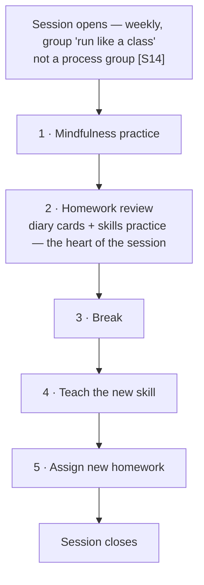
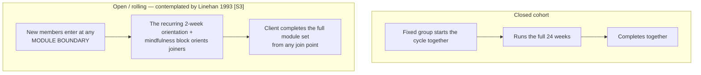

Purpose: the "expected flow" half of the comparison Ben asked for — what standard DBT
skills-training looks like as defined by Marsha M. Linehan and the Linehan-lineage institutions
(Guilford Press, Behavioral Tech, DBT-Linehan Board of Certification). All external citations
**[S]** resolve in [09-references.md](/dbt-spec/09-references/). Claims that could not be verified
from a quality source are flagged inline.

**Framing that matters:** Linehan's model is explicitly **"flexibility within fidelity"** [S6] —
the manual ships multiple curricula of different durations for different populations [S5],
teaching notes cover "orientation, pacing, and adjusting to different client groups" [S8], and
leaders are "not expected to get through all of the materials in each module" [S10]. The
invariants are: the module set, mindfulness-first-and-repeated, the homework-review session
shape, weekly class format, two leaders when possible, diary cards. A clinic's custom rotation
or session length is a *legitimate adaptation*, not drift — 02 shows exactly where DBT Network
of Utah exercises that license.

---

## 1. The canonical module set

| Module | Covers | Notes |
|---|---|---|
| **Core Mindfulness** | Wise Mind; "What" skills (Observe, Describe, Participate); "How" skills (Nonjudgmentally, One-Mindfully, Effectively) | Foundational — always taught first and re-taught between modules [S5, S10] |
| **Distress Tolerance** | Crisis survival (STOP, TIP, ACCEPTS, Self-Soothe, IMPROVE); reality acceptance (Radical Acceptance, Turning the Mind, Willingness) | [S5] |
| **Emotion Regulation** | Naming emotions; check the facts; opposite action; problem solving; ABC PLEASE; building mastery; coping ahead | [S5] |
| **Interpersonal Effectiveness** | DEAR MAN / GIVE / FAST; clarifying priorities; the Dime Game; walking away | [S5] |
| **Walking the Middle Path** | Dialectics, validation, behavior-change strategies — **adolescent/family only** (Rathus & Miller) | [S2] |

## 2. The standard 24-week cycle

Best-documented arrangement (Linehan 2nd-ed. materials, Table 2.2 lineage, reproduced by
Triangle Area DBT [S10]):

- 2+6+2+7+2+5 = 24 weeks for one pass; **repetition is built in at the standard level** —
  DBT-LBC program certification specifies "6 months with the ability to repeat if clinically
  indicated" [S8], and the 12-month research protocol is the cycle run twice [S10, S16].
- **Module order is not invariant across Linehan-approved schedules** — the Table 2.2 schedule
  teaches DT first; documented adolescent rotations interleave Walking the Middle Path [S10].
  The invariants are *mindfulness first* and *mindfulness repeated between modules*. (One
  secondary source claims an IE-second Linehan schedule — unverified [S10, flagged].)
- Documented variants: 12-week condensed, 16-session, 20-week, open/rolling [S13–S15].
- DBT-A (adolescent): ~16–24 weeks, multifamily format, ~2-hour sessions, 4–10 families [S16].

## 3. The standard session agenda

- **Length/frequency:** Linehan's own groups 2.5 h; the DBT-LBC program standard is **120
  minutes** for both adult and multifamily-teen groups; community programs commonly compress to
  90 minutes; always weekly [S8, S10, S14, S16].
- **Exact minute allocations** of the agenda are in the manual and not freely published —
  treat any specific minute figure as unverified until read from the manual [flagged in S-curriculum].
- **Two leaders is the ideal** — "Having two leaders is often more effective… one person
  presents, the other assists and observes" — though Linehan notes running alone when necessary
  [S1]. Typical group size 4–8 [S1, S10].
- **Homework is structural, not optional**; the standard response to uncompleted homework is a
  brief behavioral (chain) analysis of what interfered [S14, S17]. **Diary cards** are the daily
  self-monitoring tool; official Linehan diary cards are distributed free by the Linehan
  Institute [S7]; DBT-LBC program manuals must include them [S8].

## 4. Enrollment models — closed cohort vs open/rolling

- The 2-week orientation/mindfulness block at each module start **is the mechanism that makes
  open enrollment work** — joiners can be oriented at any boundary without a "beginning" [S10].
- Open-enrollment skills groups show attendance and symptom gains in pilots (Ritschel 2015 [S13]).
- Mid-module joins typically require 15–30 minutes of orientation [S17].

## 5. Completion, absences, and roles

- **Completion** = one full cycle (all modules). No client-side "certification" exists in DBT —
  certification is for clinicians and programs; client-side discharge/re-entry criteria are
  program-defined but must be written down in a DBT-LBC program manual [S8].
- **The "4-miss" rule is a recognized program-level norm:** DBT-LBC program certification
  requires every certified program to carry a "Policy for 4-misses" (and a 24-hour
  late-cancellation rule) — but the policy *content* is set by each program [S8]. The research
  origin: adolescents removed from study after missing four consecutive individual or group
  sessions, for safety, with outreach — not automatic termination [S4].
- **Make-up sessions are not a canonical manual element** — no Linehan-authored make-up
  protocol exists; local adaptations include individual review and orientation sessions
  [flagged in S-curriculum].
- **Roles:** group leader / co-leader / skills trainer (two-leader ideal); individual
  therapist; phone coach; consultation team. **"Proctor" is not standard DBT terminology** — it
  appears nowhere in Linehan-lineage materials.

---

## 6. What this baseline is FOR in this spec

1. The comparison table in [02-dbtu-custom-practice.md](/dbt-spec/02-dbtu-custom-practice/) maps
   every DBTNU practice to this baseline and labels it *same / licensed adaptation / local
   invention*.
2. Where DBTNU practice is a **local invention with no Linehan counterpart** (e.g., the
   free-pass, the miss ladder's specific thresholds, module-close windows), the spec says so —
   those are the practice's own business rules and must come from the practice, not from DBT
   authority.
3. Where DBTNU practice **omits a Linehan invariant** (diary cards / homework tracking), the
   spec records the omission as a deliberate scope decision (D-07 lineage: outcomes and diary
   cards tracked in SimplePractice or not at all), not an oversight.
