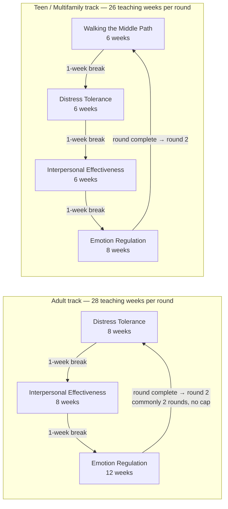
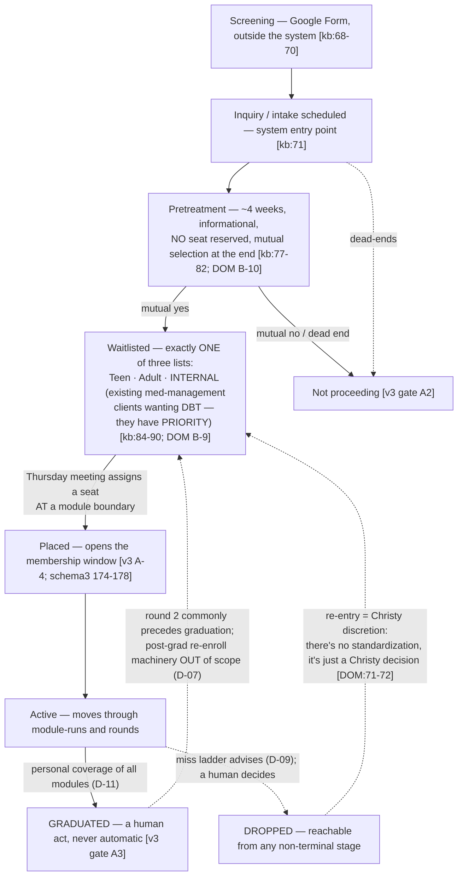

Purpose: the second half of Ben's comparison — DBTNU's own practices, as documented across v1/v3
(sources: v1 `research/knowledge-base.md` [kb], v1 `docs/logic/business-logic-*.md`, v1
`docs/requirements/dbt-utah-2026-06.md` [req], v1 `docs/archive/estate-2026-08/audit/
2026-06-16-owner-decisions.md` [owner-dec], v3 `DOMAIN.md` [DOM], v3 `artifacts/m1-gate/
b11-proposal.md` [b11]). All are the practice's own words or their recorded decisions, cited.

## 1. Context

- ~30 clients in the comprehensive DBT program, inside a ~300-client clinic [DOM:67]. Replacing
  manual spreadsheets across 14+ tabs (`v1 docs/archive/estate-2026-08/audit/01-history-purpose.md:13-15`).
- Staff: **Christy** (owner, final discretion), Brittany (clinician), Sarah, Dez, Kristie, Espra,
  Stacey, Logan, Melody, Brynn; Ben (developer/partner, operates a system holding the practice's
  PHI — `v3 DEPLOY.md:67-68`).
- The comprehensive program = individual therapy + skills class; the skills-class side is what
  this system runs. Attendance notes serve as communication between class teachers and
  individual therapists [kb:243-245].
- **The Thursday review meeting is the operational heartbeat** [DOM:67 B-16] — placement and
  planning happen there.

## 2. The rotation (their own module order and lengths)

- Practice-confirmed 2026-07-27: adult **DT→IE→ER** (8/8/12), teen **MP→DT→IE→ER** (6/6/6/8)
  (`v1 business-logic-classes.md:17-19`). **Order is program-fixed but NOT DBT-fixed** — it
  lives as per-class rows, never a code constant, and any cohort may legitimately differ (v3
  A-9, DOM:44). (An older superseded order — adult IE→ER→DT — still appears in stale v1 docs:
  kb:15-32, `v1 docs/navigation/DATA_MODEL.md:211-213`.)
- **Unit is WEEKS, not sessions** — meetings/week varies by class (1 or 2) [DOM:62 B-11].
- **1-week break between module runs** [DOM:62 B-11; kb:36].
- **Mindfulness is a ~20-minute opening segment of every session — never a module** ("if it
  ever appears as one, the model has been misunderstood", DOM:28).
- **Holiday flex:** "sometimes, with holidays, we have to take a week off, so that pushes the
  dates" [b11:66-68; kb:37].
- **Entry at module boundaries only; mid-module entry does not exist** (v3 A-4, DOM:39). Plus
  the practice's **2-week close**: "once a module starts, after the first two weeks, it's
  closed. For example, with the 12-week class… no one can enter for ten weeks" [b11:63-65; kb:35]
  — quoted practice speech, never yet a domain fact → **O-07**.
- Clients **cannot pick modules** — all modules in order; a restarting client whose next
  available module is already-completed may wait for an un-completed one [kb:34-39].

## 3. The weekly class grid (as run by the practice)

From the practice's own sheet [kb:46-53]:

| Class | Schedule | Format | Meetings/week |
|---|---|---|---|
| Multifamily (Teen) | Wed + Thu 6–7pm | Online Wed · In-person Thu | 2 |
| Adult AM | Tue + Wed 9–10am | In-person | 2 |
| Adult PM (Wed) | Wed 6–8pm | Virtual | 1 |
| Adult PM #1 | Tue + Thu 6–7pm | Virtual | 2 |
| Adult PM #2 | Tue + Thu 6–7pm | Virtual | 2 |

- Classes are named by weekday and run the rotation **unsynchronized** — each class moves at its
  own position and pace (v3 B-13, DOM:64); the two "Adult PM" sections are distinct sections
  ("#1/#2" is the practice's own naming, kb:52-53).
- Session length varies per class (1h vs 2h) [kb:46-53; DOM:66 B-15 provisional].
- **All classes have 2 DBTNU employees** leading; employees swap roles between classes (Ben,
  interview R4 — D-08).

## 4. The client pipeline (inquiry → graduation)

Pipeline vocabulary (v3's nine-event spine is the canonical carry-forward:
INQUIRY · PRETREATMENT_STARTED · WAITLISTED · NOT_PROCEEDING · PLACED · MODULE_COMPLETED ·
GRADUATED · DROPPED · RETURNED — statuses derived, never stored; `v3 prisma/schema.prisma:193-203`).

Key practice rules:
- **Waitlist exclusivity:** a client may be on only ONE of the three lists (practice rule,
  owner-dec:54; enforced structurally in v3 via partial unique index, `v3 artifacts/m1-gate/ERD.md:151-159`).
- **Internal priority is displayed, never enforced** (DOM B-9).
- **Rule-bending is official policy:** "DNU bends its own rules to accommodate clients" —
  auto-actions are overridable (owner-dec:18); v4 turns this into D-09's advisory-only stance.
- **Missed individual-therapy appointments count as series misses** (owner-dec:18) — carried
  into v4 by D-09; needs a Provider-facing logging path (**O-15**).

## 5. Session nights & attendance (as practiced)

- The teacher runs the night: roster, mark each client, handle excused absences, see miss flags
  and end-of-round signals, confirm who co-led, contact info visible for contract therapists
  who lack SimplePractice (`v1 docs/pack/flows/attendance.md`; `v1 2026-06-10-dbt-user-flows-design.md:57-66`).
- Legacy spreadsheet codes were richer than any app generation: Y / N / X (note done) / I
  (billed) / L / FREE / self-pay / "missing note", compound cells like "Y/X/I" [kb:113-131];
  v4 settles on **Present · Late · Absent · Free-pass** (D-10).
- **The one free no-show per series** is long-standing practice (per module in the oldest
  sheets [kb:140-144] → per series canonical since 2026-06-11, `v1 docs/DECISIONS.md:86-88`).
  In v4 it is recorded but still counts as a miss (D-10) — its fee-waiver meaning is gone with
  billing out of scope (**O-19** confirms intent).
- **Attendance is part of the legal health record** — soft-delete corrections only; retention
  "years past last care; minors far longer" (v3 A-10, DOM:45; `v3 DEPLOY.md:62-63`).
- End-of-round color signals: **Red = client in final module of round; Yellow = second-to-last
  — a prompt to have the round-2 conversation** (DOM:65 B-14), advisory only.

## 6. Delta table — DBTNU vs the Linehan baseline

| Dimension | Linehan baseline [01] | DBT Network of Utah | Classification |
|---|---|---|---|
| Module set | MF · DT · ER · IE (+ MP adolescent/family) | DT · IE · ER (adult); MP · DT · IE · ER (teen) | Same set; MP on teen track as designed |
| Mindfulness | 2-week module at every rotation position | ~20-min segment of every session; never a module | Licensed adaptation (manual permits curricula variation) — and a deliberate modeling rule (DOM:28) |
| Cycle length | 24 weeks | Adult 28 weeks · Teen 26 weeks (+ breaks) | Licensed adaptation |
| Module order | Adaptable; mindfulness-first invariant | Fixed per program (DT first adult; MP first teen), stored per-class | Licensed adaptation |
| Rounds | Cycle commonly run twice (~12 mo) | Same — commonly 2 rounds, no hard cap (Brynn = 3) | Same norm |
| Session length | 120 min standard (2.5 h Linehan's own) | 60 min (most classes) or 120 min (Wed PM) | Local choice; shorter than standard |
| Frequency | Weekly | 1–2 meetings/week per class | Local choice |
| Session agenda | Mindfulness → homework review → break → teach → assign | Mindfulness segment + teaching; homework/diary cards NOT tracked in this system | **Omission** (deliberate scope: D-07 lineage) |
| Enrollment | Open-at-boundary is legitimate | Entry at module boundaries only + own 2-week close rule | Same mechanism + local addition |
| Leaders | Two leaders ideal | **Two DBTNU employees per class, always; roles swap** (D-08) | Same norm, stricter |
| Attendance codes | Program-defined | Present / Late / Absent / Free-pass (D-10); Late = present | Local invention |
| Miss policy | "Policy for 4-misses" required; content program-defined [S8] | Cumulative per series, warn@2/crit@3/max@4, advisory only, humans drop; IT-misses count (D-09) | Local invention (satisfies the certification requirement to have a written policy) |
| Free absence | No canonical concept | One free-pass per series, recorded, still counts (D-10) | Local invention |
| Make-ups | Not canonical | All three modes: skip / shift / makeup (D-13) | Local addition |
| Graduation | Complete the cycle; repeat if clinically indicated | Personal coverage of full rotation + human act (D-11) | Same spirit, per-client precision |
| Billing | — (not a DBT concept) | External in SimplePractice; zero integration (D-05) | Out of system |
| "Proctor" | Not standard DBT terminology | "Teacher" in v4 (D-08); practice speech says proctor/teacher/leader | Local vocabulary |

**Reading:** DBTNU runs a legitimate Linehan-adapted program. The spec's job is to encode the
local-invention rows as the practice's own business rules — sourced from the practice, not from
DBT authority — and to keep the licensed-adaptation rows explicit so nobody "corrects" them
toward the book later.

## 7. Discretion culture (Layer C — carry forward unchanged)

Christy retains case-by-case judgment on: re-entry terms, restart alignment, waitlist ordering,
miss-rule overrides, round-3+ retention, seat assignment (DOM:78-87). Brittany, verbatim:
"There's no standardization. It's just a Christy decision." (DOM:71-72). v4's design stance —
inherited from v3 and reaffirmed by D-09/D-11/D-12 — is **record, never enforce**: the system
surfaces, suggests, and flags; humans decide; every discretionary act rides a decision record.
