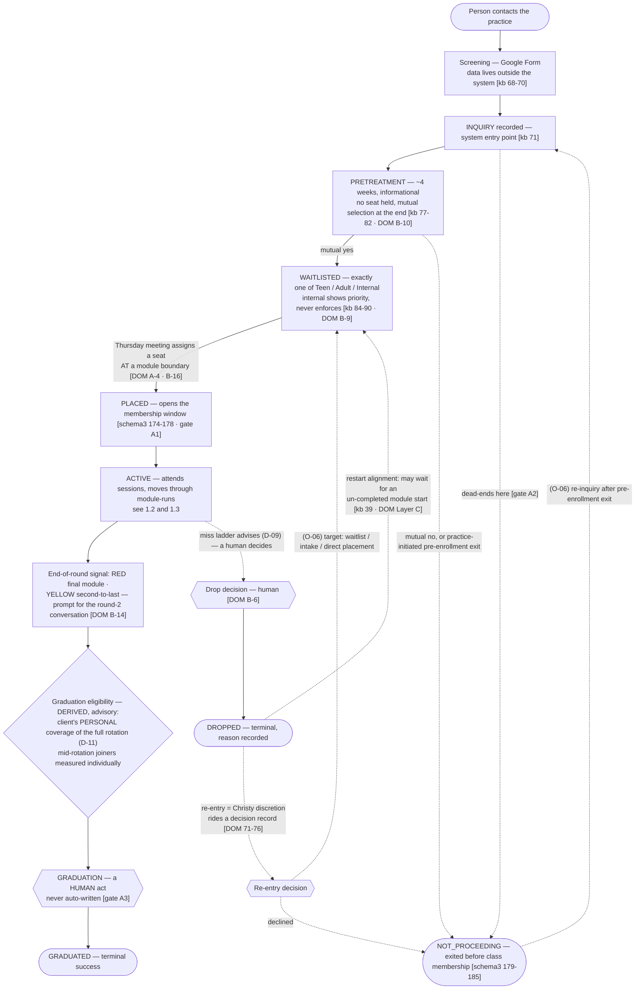
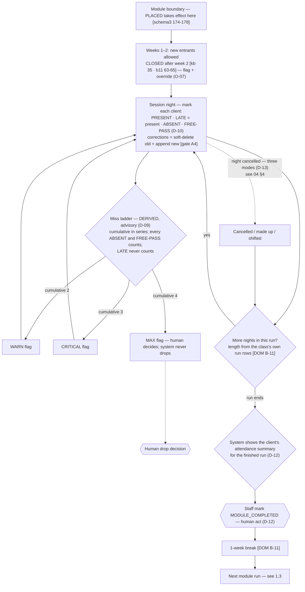
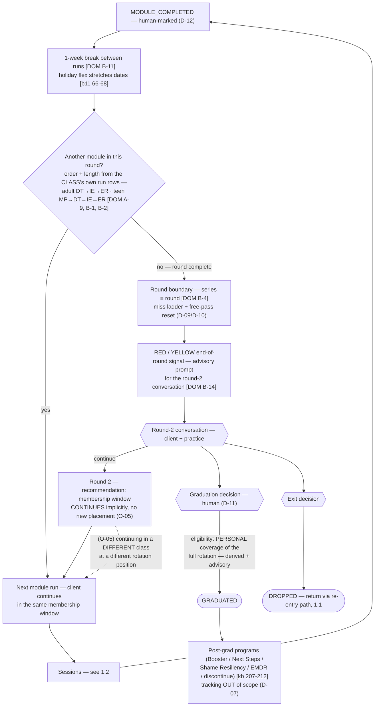

Per D-04 (staff-only) and the R2 interview answer, "user lifecycle" = **client** lifecycle.
Three flows requested: 1.1 initial contact → graduation; 1.2 movement through a module;
1.3 module → module. Sources: v1 `research/knowledge-base.md` [kb], v1
`docs/logic/business-logic-pipeline.md` [pipe], v1 `docs/logic/business-logic-classes.md`
[cls], v3 `DOMAIN.md` [DOM], `prisma/schema.prisma` [schema3], `artifacts/m1-gate/*` [gate/b11].

---

## 1.1 — Full client lifecycle (contact → graduation/exit)

Hexagon `{{ }}` = human discretion point. Dashed = open or discretionary path.

**Happy-path requirements**

- REQ-CL-01 — The system records the client journey as an **append-only event spine**;
  statuses (inquiry / pretreatment / waitlisted / placed / active / graduated / dropped /
  not-proceeding) are **derived at read time, never stored** (inherited v3 Rule 2).
- REQ-CL-02 — A client holds **at most one open waitlist entry** across all three lists,
  enforced structurally (v3 ERD.md:151-159 precedent).
- REQ-CL-03 — Internal-list priority is **displayed** (placement ranking surface), never
  enforced.
- REQ-CL-04 — Placement happens at **module boundaries only**; the placement event carries the
  boundary date and opens the membership window.
- REQ-CL-05 — Graduation eligibility = personal coverage (all modules of the client's track
  rotation completed, per D-11/D-12); the eligibility display is advisory; the GRADUATED act is
  human and appends an event.
- REQ-CL-06 — DROPPED is reachable from any non-terminal stage; the drop records date, actor,
  reason, and the client's completed-modules snapshot.
- REQ-CL-07 — Re-entry after DROPPED is recorded as a discrete event riding a decision record
  (who/when/why invited/what it overrode); the entry target is **O-06**.
- REQ-CL-08 — NOT_PROCEEDING covers inquiry dead-ends, pretreatment declines, and waitlist
  withdrawals (gate A2), with an optional reason discriminator.

**Edge cases to cover** (full catalog: [08-missed-use-cases.md](/dbt-spec/08-missed-use-cases/))

| # | Case | Handling direction |
|---|---|---|
| 1 | Pretreatment restart after a gap | New PRETREATMENT_STARTED event; clock per-attempt (**open**, O-06 scope) |
| 2 | Placed but never attends first session | Miss clock anchor: from PLACED or first attendance? Exit path = drop with reason (**open**) |
| 3 | Placed into a run already >2 weeks in | 2-week close rule — surface as flag + owner override (**O-07**) |
| 4 | Duplicate client records | Merge tool or void-and-recreate (**open**; v1's unique constraints made this crash — pipe R44) |
| 5 | Deceased / permanently departed | Neither terminal fits; vocabulary gap (**O-24**) |
| 6 | Teen ages out / track crossover | Track-change event needed (**O-20**) |
| 7 | Client in two classes at once | Default: one active membership window; family dual-seat question (**O-16**) |
| 8 | timesGraduated integrity | Counter starts at 0 (v1 bug: born at 1 — cls G2) |
| 9 | Graduated client returns later | Post-grad re-enroll machinery OUT (D-07); record as new inquiry carrying history (**open**) |
| 10 | Early mutually-agreed completion mid-round | No "mutual early completion" reason exists — add to reason list (**open**) |

---

## 1.2 — Movement through a single module

**Requirements**

- REQ-CL-09 — Module completion per client is **human-marked with a system suggestion** (D-12):
  the suggestion surface shows the client's attendance for the finished run; no auto-threshold.
- REQ-CL-10 — Miss ladder derivation: cumulative ABSENT + FREE-PASS within the current series
  (≡ round); LATE and PRESENT never count; cancelled nights are skipped; the ladder resets at
  each round's first session (free-pass window likewise).
- REQ-CL-11 — Missed **individual-therapy** appointments feed the same ladder (D-09); logged by
  the client's Provider against the current series (**O-15**: surface design).
- REQ-CL-12 — Mid-module drop: the completed-modules snapshot records only modules the client
  completed (the in-progress module does NOT auto-count — rejecting v1 cls G4's inference;
  partial-credit semantics confirmed with practice per O-06).
- REQ-CL-13 — 2-week close is a **surfaced flag with owner override**, never a block (O-07
  recommendation; consistent with record-never-enforce).

---

## 1.3 — Module → module, round → round, graduation decision

**Requirements**

- REQ-CL-14 — The class's rotation order and module lengths are **per-class rows** (never
  constants); defaults seeded from the track on class creation (inherited v3 A-9).
- REQ-CL-15 — Round boundary is derived from taught history (last run of the rotation
  completed), never hard-coded; the miss ladder and free-pass window reset at each round's
  first session.
- REQ-CL-16 — "X of N" progress display: recommendation = across-two-rounds denominator
  (X of 6 adult / X of 8 teen), **unclamped** for round 3+ (**O-18**).
- REQ-CL-17 — Mid-rotation joiners: personal coverage tracked per client; the end-of-round
  red/yellow signal and graduation eligibility evaluate each client's own coverage, not the
  class calendar (D-11 consequence; v1 never computed this — cls U8).
- REQ-CL-18 — A client may continue a subsequent round in a different class; modeled as an
  exit-from-old-membership + placement-at-boundary pair (**O-05**).
- REQ-CL-19 — A dropped client's restart alignment (wait for an un-completed module) is a
  recorded discretionary act riding a decision record [kb:39; DOM Layer C].

**Design note — the four topology decisions this area rides on** (from the wave-2 analysis,
now mostly settled): graduation = personal coverage (settled, D-11); MODULE_COMPLETED =
human-marked (settled, D-12); round-2 continuation vs new placement (**O-05** — recommend
implicit continuation); re-entry target (**O-06** — recommend waitlist with preserved
completions).
