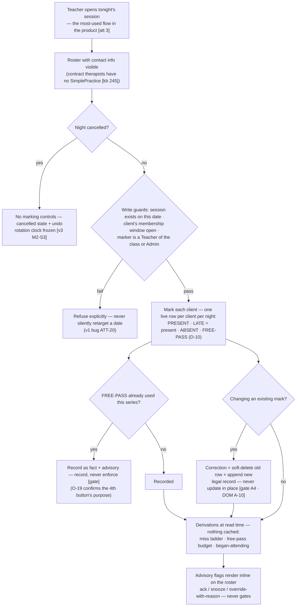
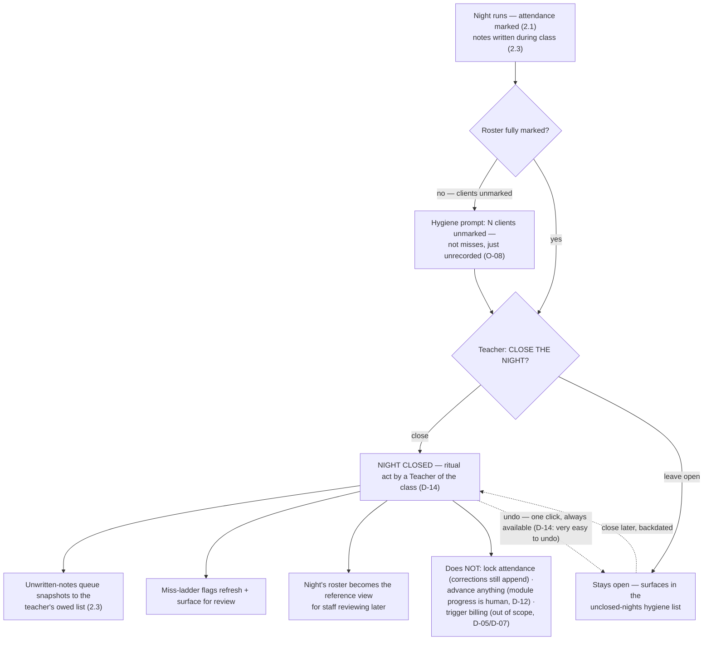
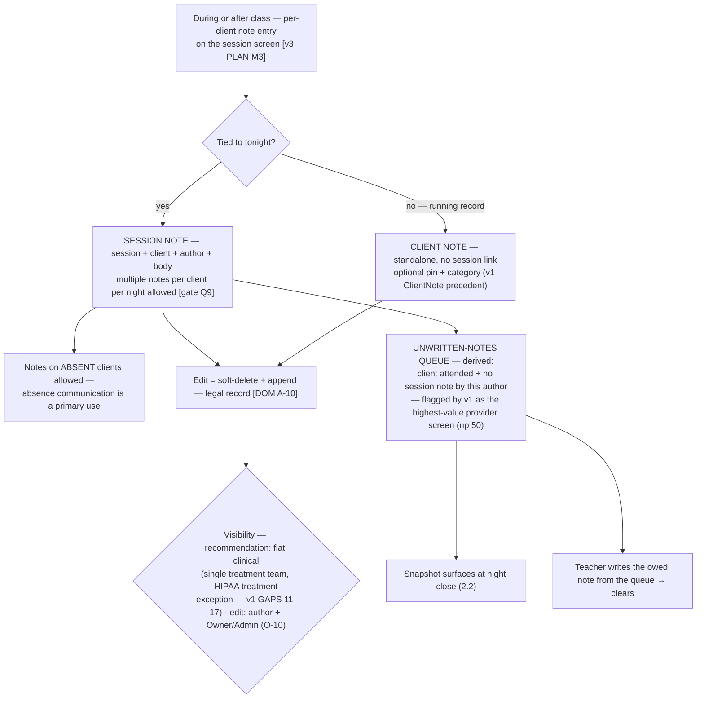
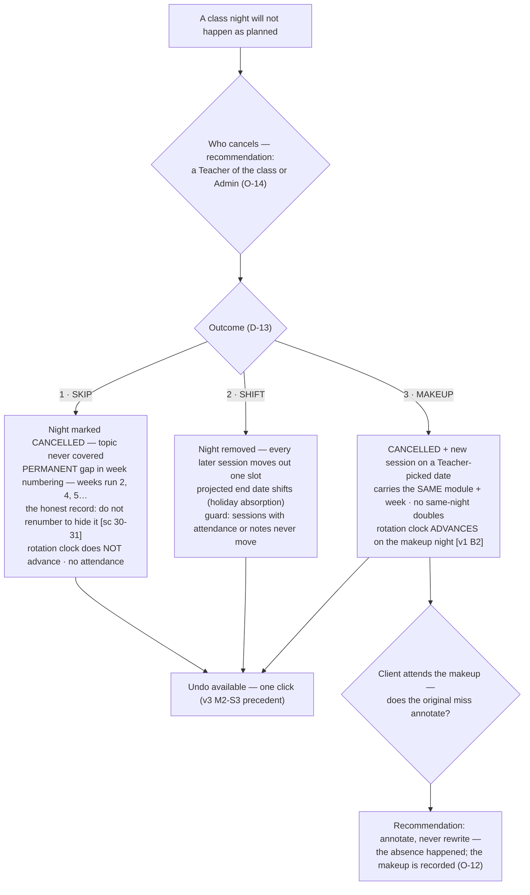
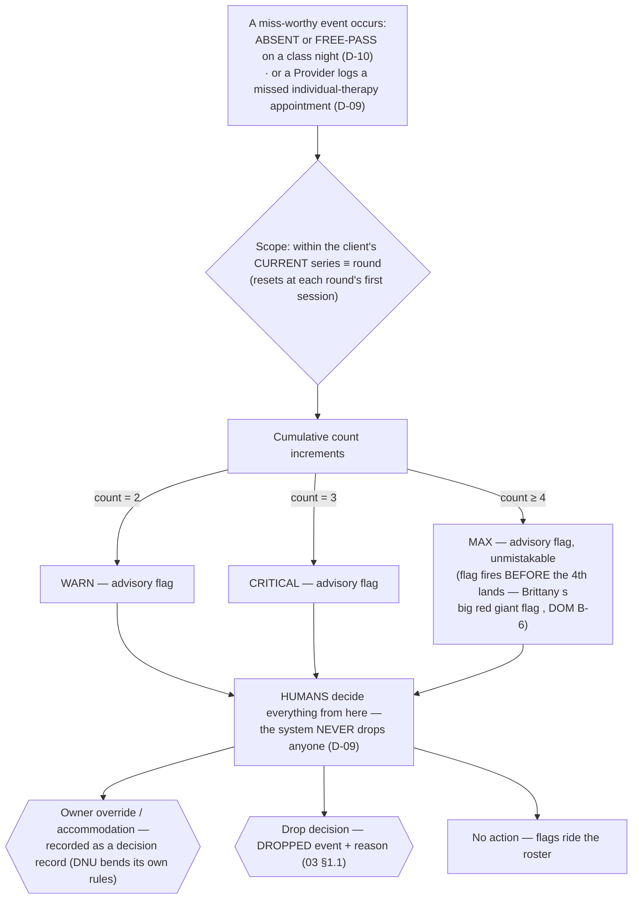

Flows requested: 2.1 marking attendance · 2.2 marking the session complete · 2.3 notes on
clients during the session. Plus the two engines that hang off session night: cancellation
(D-13) and the miss ladder (D-09/D-10). Sources: v1 `docs/pack/flows/attendance.md` [att], v1
`docs/requirements/session-cancellation.md` [sc], v1 `docs/requirements/notes-for-providers.md`
[np], v3 `DOMAIN.md` [DOM], `prisma/schema.prisma` [schema3], `artifacts/m1-gate/*` [gate].

---

## 2.1 — Marking attendance

**Requirements**

- REQ-SO-01 — Attendance codes: **Present · Late · Absent · Free-pass** (D-10). Late = present
  for all derivations; every Absent **and** Free-pass counts toward the miss ladder; one
  free-pass per series, anchored at the round's first session.
- REQ-SO-02 — At most one **live** attendance row per client per session (soft-delete +
  append for corrections — inherited gate A4).
- REQ-SO-03 — Guards: no marking on cancelled nights, future dates, off-nights, or clients
  outside an open membership window; failures are explicit.
- REQ-SO-04 — Backfilling past nights is allowed; every row carries both **effective date**
  (the session) and **recorded-at** (the write) — the audit trail distinguishes them.
- REQ-SO-05 — Unmarked clients on a past night are **not** misses; a "nights unrecorded"
  hygiene advisory surfaces to the class's Teachers (**O-08**, recommendation; spreadsheet
  blank=missed semantics rejected).
- REQ-SO-06 — A client who attended but is outside the guard (wrong section of an identical
  Tue/Thu pair, dropped-but-showed-up) gets a sanctioned "attended out-of-roster" fact or an
  annotation path, not a silent refusal (practice-bending reality; see 08 §2).

## 2.2 — Completing the session: the Close/Lock ritual (D-14)

Ben's direction (R3): *"worth adding a ritual to a session that is a 'close' or 'Lock'… very
easy to undo… a helpful ritual to the employees."* Prior generations: v1 had a COMPLETED enum
value **no user could ever set** [sc:35-43]; v3 deliberately had no completion state. v4 adds
the act back — as a soft ritual, not a lock on the legal record.

**Requirements**

- REQ-SO-07 — A Teacher of the class (or Admin) can **close** a night; closing is a recorded
  act with actor and timestamp.
- REQ-SO-08 — **Undo is one click** and always available (re-opening is itself recorded);
  closing/undoing never mutates attendance or notes.
- REQ-SO-09 — Closing does not gate corrections: soft-delete + append remains available on
  closed nights forever (legal-record semantics, DOM A-10).
- REQ-SO-10 — Unclosed past nights surface in a hygiene list to the class's Teachers
  ("nights unrecorded" — gate Q11 lineage).
- REQ-SO-11 — Zero-attendee night: closable like any other; whether the rotation clock
  advanced is a property of taught-sessions policy (**O-13** — recommendation: the clock
  follows what the Teachers taught, independent of attendance).

## 2.3 — Notes on clients during the session

Brittany, repeatedly: "Notes are almost a first-class thing for providers" [np:5-7]. Practice
usage: attendance notes = communication between class teachers and individual therapists
[kb:243-245].

**Requirements**

- REQ-SO-12 — Two note kinds: **session notes** (per client per night, multiple authors) and
  **standalone client notes** (pinnable) — both first-class (**O-11** recommendation).
- REQ-SO-13 — The **unwritten-notes queue** is derived (attended + no note by this author),
  surfaces at night close, and links straight to writing the owed note.
- REQ-SO-14 — Editing is author-only plus Owner/Admin; all edits are soft-delete + append with
  full trail; nothing hard-deletes.
- REQ-SO-15 — Notes never detach from their session: sessions with attendance or notes are
  immutable to any calendar regeneration (v1's SetNull detachment hazard — sc:48-51 — is a
  never-again rule).
- REQ-SO-16 — Visibility default = flat clinical access across Owner/Admin/Provider/Teacher,
  per the treatment-team doctrine (**O-10** confirm with practice).

---

## The cancellation engine (D-13 — all three modes)

v1 spec'd all three, built none [sc]; v3 built skip only. v4 builds all three:

- REQ-SO-17 — All three modes exist with one write path each; undo is one click and recorded.
- REQ-SO-18 — Week-number gaps from skips are permanent and visible; renumbering to hide gaps
  is prohibited [sc:30-31].
- REQ-SO-19 — Shift mode never touches sessions carrying attendance or notes (immutability
  rule, REQ-SO-15).
- REQ-SO-20 — A makeup session may itself be cancelled (revert to skip semantics) — **O-12**
  covers attendance-annotation semantics.

## The miss-ladder engine (final policy: D-09 + D-10)

All four prior variants (Master-Log 4-consecutive-auto-remove; v1's shipped 1/2/3; Christy's
2026-06-16 cumulative; v3's consecutive-4 advisory) are **superseded** by the interview
decision. Final rule:

- REQ-SO-21 — Ladder inputs: every ABSENT and FREE-PASS in the current round, plus
  Provider-logged missed individual-therapy appointments; LATE/PRESENT never count; cancelled
  nights are skipped entirely.
- REQ-SO-22 — Escalation warn@2 / critical@3 / max@4, all advisory; the max flag must be
  visible before the miss that would make 4 lands (advance warning, DOM B-6).
- REQ-SO-23 — No automatic drop, ever; every override or accommodation rides a decision
  record.
- REQ-SO-24 — The Provider-facing path to log a missed individual-therapy appointment exists
  (**O-15**) and feeds the same ladder.
- REQ-SO-25 — A **planned-absence annotation** (vacation, hospitalization, school) may be
  recorded on future nights: visible to staff, reason-blind to the ladder (misses still count;
  humans see why) — **O-21** recommendation, directly reduces override volume for medical
  leaves.

**Edge cases** (full catalog in 08): concurrent marking by two staff (last-write wins +
surface "already marked by X"); attendance dispute weeks later (legal-record amendment flow);
proctor forgets to mark until next week (backfill + both timestamps); client attends the wrong
identical section (out-of-roster fact); Zoom outage mid-night (degraded-night note);
substitute Teacher for one night (per-night leader record — see 06 §3, payroll-adjacent).
