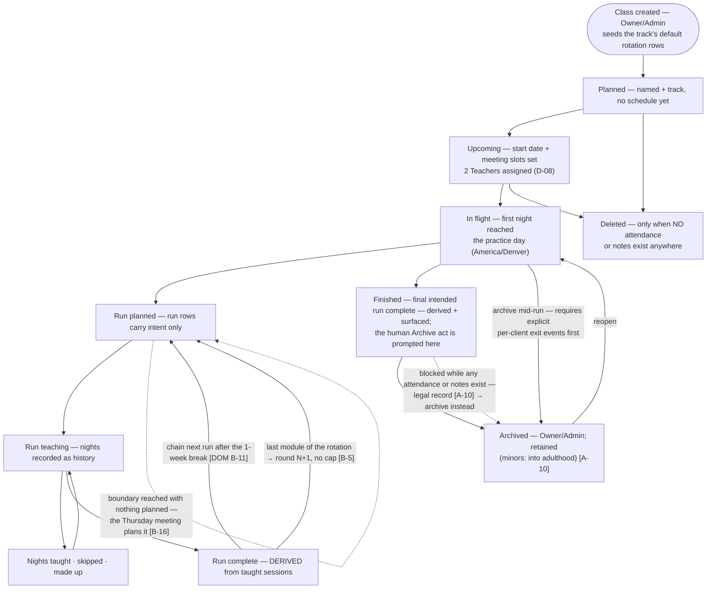
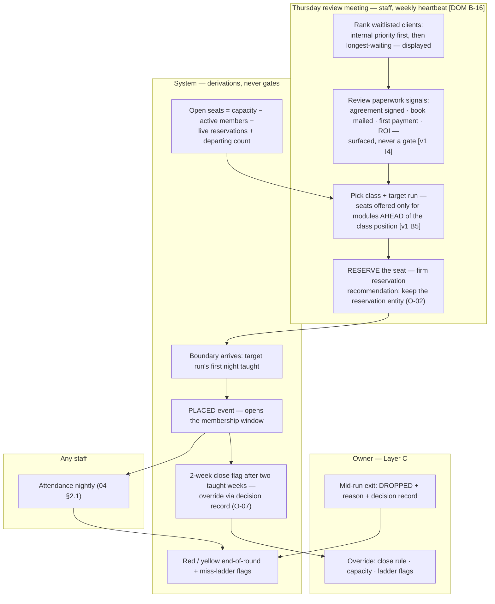
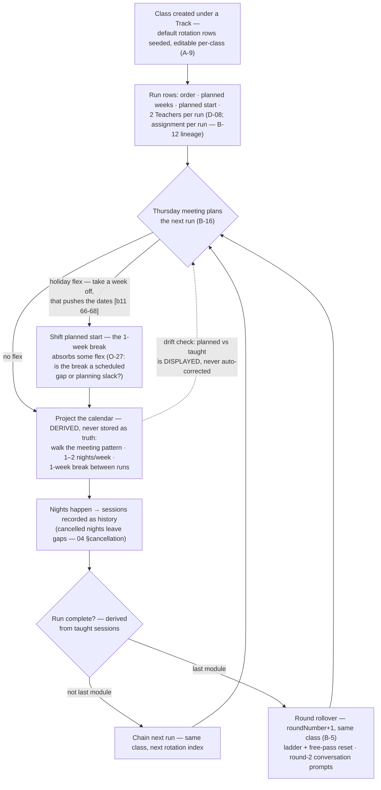

Flows requested: 3.1 module management (create/edit/archive/delete/complete) · 3.2 adding and
removing clients · 3.3 ordering/chaining/calendar organization. Sources: v1
`docs/logic/business-logic-classes.md` [cls], v1 `research/knowledge-base.md` [kb], v3
`DOMAIN.md` [DOM], `prisma/schema.prisma` [schema3], `artifacts/m1-gate/*` [gate/b11/ERD].

Vocabulary reminder: **module** = curriculum unit · **module-run** = one module taught in one
class in one round · **class** = the weekday cohort · **session** = one night.

---

## 3.1 — Module & class lifecycle

(States other than **Archived** are derived, never stored — REQ-MM-02.)

**Requirements**

- REQ-MM-01 — Creating a class (Owner/Admin): name, track, meeting pattern (list of
  weekday+time slots), capacity; the track's default rotation rows are seeded and are
  immediately editable per-class (inherited A-9).
- REQ-MM-02 — Class states are **derived** (planned/upcoming/in-flight/finished) from dates and
  taught history; **Archived is a human act**; nothing auto-completes (v1 B6 lesson) —
  the derived "finished" state is surfaced so the human archive act is prompted, not forgotten.
- REQ-MM-03 — Module-runs are rows: one per (class, round, rotation index) with planned weeks
  and planned start; "planned dates are intent, sessions are history" (schema3:84).
- REQ-MM-04 — Editing a run (length, start, order of *future* runs, Teachers) never regenerates
  or touches sessions with attendance or notes; already-taught history is immutable. The v1
  regeneration hazards (cascade-deleted leader rows, detached notes — sc:48-51) are designed
  out permanently.
- REQ-MM-05 — Run completion is derived from taught sessions; per-client completion is a
  separate human act (D-12).
- REQ-MM-06 — Archive requires every client to have an explicit exit event (or explicit
  transfer); archiving never mutates attendance/notes.
- REQ-MM-07 — Deletion is permitted only when no attendance or notes exist anywhere in the
  class; otherwise archive-with-retention is the only path (legal record — DOM A-10).
- REQ-MM-08 — Reopen from Archived returns the class to its derived state without fabricated
  history.

**Edge cases:** edit module length mid-run (future sessions re-project, taught weeks
immutable); reorder remaining modules mid-round (legitimate — A-9; reservations pointing at a
moved target get re-confirmed); change meeting days mid-run (future-only; no destructive
regeneration); class merge (two Tue/Thu sections — exit+place pairs, rotation history forks);
class split (Layer C seat assignment); archive mid-run (per-client exits first); round rollover
timing (Thursday meeting — O-05); zero-client run (floor question, O-17 min-viable-size
lineage); a class pauses 3 weeks (clock simply frozen — pause is absence of taught nights,
planned dates drift visibly — **O-26 recommendation**: show drift explicitly rather than model
a pause entity).

---

## 3.2 — Adding / removing clients from a module

**Requirements**

- REQ-MM-09 — Roster add: waitlist → (Thursday) firm **reservation** for a specific future
  module-run → **PLACED** at the boundary (O-02 recommendation: keep the reservation entity —
  it matches the practice's real workflow and v1's FutureEnrollment precedent).
- REQ-MM-10 — Reservation slides with its run (targets a run, never a date); if the run moves
  materially (reordered, delayed >2 weeks), the placement surface flags it for re-confirmation.
- REQ-MM-11 — Roster remove: DROPPED or GRADUATED (human acts) close the membership window;
  transfers out are modeled as explicit exit + placement pairs.
- REQ-MM-12 — A client holds at most one open waitlist entry and at most one live reservation.
- REQ-MM-13 — Over-reservation (more reservations than seats after a capacity shrink) surfaces
  as a collision on the placement surface with the ranking shown — the owner chooses; nothing
  auto-evicts.
- REQ-MM-14 — Paperwork signals are surfaced next to candidates, never enforced.

**Edge cases:** reserved client's boundary moves (re-confirm); waitlist withdrawal mid-reservation
(reservation released); returning client alignment (wait for un-completed module — kb:39);
teen turns 18 mid-program (track crossover, O-20); family seat-unit question for multifamily
(O-16); capacity change mid-run (shrink = over-capacity flag, never eviction).

---

## 3.3 — Ordering, chaining, and calendar organization

**The weekly grid** (organization target — the real practice grid, kb:46-53):

| Slot | Mon | Tue | Wed | Thu |
|---|---|---|---|---|
| 9–10am | | Adult AM (in-person) | Adult AM (in-person) | |
| 6–7pm | | Adult PM #1 + #2 (virtual) | Teen MF (online) | Teen MF (in-person) · Adult PM #1 + #2 (virtual) |
| 6–8pm | | | Adult PM Wed (virtual) | |

- REQ-MM-15 — The meeting pattern is a **list of slots** (weekday + time + format), not a
  single weekday string (v3's shape defect — gate fable-gate-review.md:84-87); format can vary
  per night (teen: Wed online, Thu in-person).
- REQ-MM-16 — The forward calendar is a **projection** derived from run rows + meeting pattern;
  it is never authoritative history; drift between planned and taught is displayed, not hidden.
- REQ-MM-17 — Chaining: next run auto-projected after the 1-week break; round rollover
  auto-projected after the last module; both await Thursday-meeting confirmation (humans plan;
  the system proposes).
- REQ-MM-18 — One session per class per calendar date (no same-night doubles; makeup dates
  must not collide — surfaced if they would).
- REQ-MM-19 — Practice-day timezone = America/Denver; sessions store UTC-midnight dates; the
  6pm-MT/UTC-day-flip is handled once, centrally (v1 C1 lesson; see 08 §5 DST edge).

**Edge cases:** the two identical Tue/Thu PM sections (#1/#2 disambiguation everywhere —
rosters, zoom links, printed lists); two classes booked into the same zoom/room (no resource
model exists yet — flagged in 08 §4 as a real collision risk); makeup landing in a break week
or on another class's night (allowed but flagged); a whole practice-week dark (holiday — five
classes × bulk-cancel; 08 §4 recommends a practice-wide holiday calendar); DST shift for
evening classes; module content updated mid-year (new manual edition — runs record what was
taught; no content versioning needed at ~30-client scale, revisit if curriculum tracking
enters scope).
