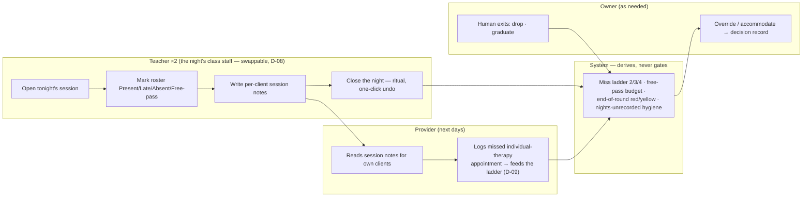

Role set decided in the interview (D-08): **Owner (Christy) · Admin · Provider · Teacher ·
Developer (Ben)**. Two Teachers per class; employees swap roles between classes; no separate
co-lead/assistant role — *"maybe we can just have a teacher role, and allow 2 teachers to a
class… Brittany and Dez are teachers of the class that teaches tues and thurs nights 6–7pm"*
(Ben, R4).

Lineage: v1 shipped OWNER/ADMIN/CLINICIAN/TEACHER (+proposed DEV/SUDO,
`v1 2026-06-16-owner-decisions.md:19`); v2 shipped OWNER/CLINICIAN/TEACHER; v3 has no role
field yet. "Teacher" matches v1's TEACHER and the practice's own speech ("teachers run class
nights"); "Provider" is the practice's word for individual therapists; practice "proctor" =
Teacher. Persons may hold multiple roles (Dez is clinician + teacher — v1
`2026-06-10-dbt-user-flows-design.md:36`); combined views shown, not toggled.

## Permission matrix

Cells marked **(a)** are *assumed from practice precedent* (v1 MAP-0/DECISIONS + compliance
docs, adapted to the five-role names) — confirm in review; everything else follows directly
from D-decisions.

| Capability | Owner | Admin | Provider | Teacher | Developer |
|---|---|---|---|---|---|
| Manage users & roles | ✔ | — | — | — | ✔ (a) |
| Create / edit / archive classes & runs | ✔ | ✔ | — | — | ✔ (a) |
| Plan rotation, calendar, capacity | ✔ | ✔ | — | view | — |
| Assign the 2 Teachers to a class/run | ✔ | ✔ | — | — | — |
| Waitlist management (add, move, withdraw) | ✔ | ✔ | — | view | — |
| Placement & reservations (Thursday meeting) | ✔ | ✔ | — | view | — |
| Mark attendance | ✔ | ✔ | — | ✔ (own classes) | — |
| Close / lock the night (+ undo) | ✔ | ✔ | — | ✔ (own classes) | — |
| Cancel a night (3 modes) | ✔ | ✔ | — | ✔ (own classes, O-14) | — |
| Session notes (write/edit own) | ✔ | ✔ | ✔ (a) | ✔ | — |
| Standalone client notes | ✔ | ✔ | ✔ (a) | ✔ | — |
| Edit/delete any note | ✔ | ✔ (a) | — | — | — |
| View client records (PHI) | ✔ | ✔ | ✔ | ✔ | ✔ (break-glass, logged) |
| Log missed individual-therapy appt (feeds ladder, D-09) | ✔ | ✔ | ✔ (own clients) | — | — |
| Mark MODULE_COMPLETED (D-12) | ✔ | ✔ | — | ✔ (own classes) | — |
| Mark graduation / drop (human exits) | ✔ | ✔ (a) | — | — | — |
| Miss-ladder overrides & accommodations | ✔ | — | — | — (flag, suggest) | ✔ (a) |
| 2-week-close override | ✔ | — | — | — | ✔ (a) |
| View audit / decision records | ✔ | ✔ | — | — | ✔ |

Access doctrine (carried from v1's compliance record, `v1 docs/compliance/GAPS.md:11-17`):
**flat clinical access** — all clinical staff may view all client records (HIPAA treatment
exception, single treatment team); restrictions live on *management* surfaces (settings,
users), not clinical data. Developer access is break-glass and logged.

## Session-night swimlane (who does what on a Tuesday night)

## Notes

- **Two-Teachers invariant** (A-7 lineage: "skills groups have ≥2 leaders") is **surfaced,
  never enforced** — a short-staffed run shows a warning; nothing blocks it (v3 stance,
  `schema3:93-95`).
- Per-night leadership (substitutes, swaps) is recorded per session at close (who actually ran
  the night), with the class's 2 standing Teachers as the default — this keeps payroll-adjacent
  accuracy without a payroll module (payroll itself is out of scope; the *facts* it needs are
  kept clean).
- Auth/security baseline inherited from v1's compliance set: short auto-logoff (HIPAA
  §164.312(a)(2)(iii) lineage), login rate limiting, audit-logged auth outcomes, soft-deleted
  users. v4 is a PHI system: the v1 compliance docs (`docs/compliance/*`) remain the checklist
  of record until replaced.
