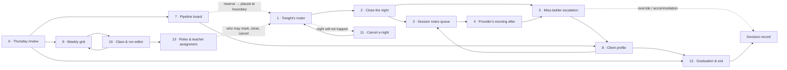

**Prototyping checklist · Audience: Ben · Requirements-derived — the spec stays source of
truth.**

A **scene** is a moment in time: one person, one goal, one trigger ("Teacher at 6:25 PM with a
room waiting"). A **card** is that scene's structural wireframe in words — five numbered lines
(who and when · see first · actions · states · goes next) plus the components, the open
decisions the screen forces into the open, and the edge cases it must render. Each card, with
its cited REQ lines pasted underneath, is the prompt for one Claude Design screen; the
[Prompt seed](#prompt-seed) below is the wrapper.

The design system was imported from v1 (`~/development/dbtdashboard`) and carries v1's tokens:
module lanes (`--module-dt/ie/er/mp`), pipeline status colours (`--status-*`), attendance and
ladder badges (`--badge-clear/warning/critical/force-drop`), and the end-of-round red/yellow
inherited from v3 (`DOM B-14`). **Assumption:** v1's `--badge-force-drop` token is re-labelled
**max** in v4 — the v4 ladder never drops anyone (D-09).

A prototype is a question, not an answer. Where a screen and this spec disagree, the spec wins;
where a screen reveals a policy gap, it goes to [07-open-decisions.md](/dbt-spec/07-open-decisions/).

---

## 1. Scene inventory

| # | Scene | Actor | Trigger | REQs | Opens forced | Order |
|---|-------|-------|---------|------|--------------|-------|
| 1 | Tonight's roster | Teacher | Class night begins | REQ-SO-01..06 | O-08 · O-19 · O-21 · O-23 · O-32 | 1 |
| 2 | Close the night | Teacher | Roster marked | REQ-SO-07..11 | O-08 · O-13 · O-29 | 2 |
| 3 | Write session notes | Teacher | Post-class or next day | REQ-SO-12..16 | O-10 · O-11 · O-29 · O-30 · O-31 | 3 |
| 4 | Provider's morning after | Provider | Reads notes; logs a missed individual-therapy appointment | REQ-SO-16 · REQ-SO-24 · REQ-CL-11 | O-10 · O-15 | 4 |
| 5 | Miss-ladder escalation | Owner | Client hits warn / critical / max | REQ-SO-21..25 · REQ-CL-10 | O-12 · O-21 · O-22 · O-32 | 5 |
| 6 | Thursday review | Owner / Admin | Weekly meeting | REQ-MM-09..14 · REQ-MM-17 · REQ-CL-03 · REQ-CL-04 · REQ-CL-13 | O-02 · O-07 · O-09 · O-16 · O-17 · O-33 | 6 |
| 7 | Pipeline board | Admin | Placing and tracking candidates | REQ-CL-01..08 · REQ-MM-12 | O-01 · O-02 · O-06 · O-20 · O-24 | 7 |
| 8 | Client profile | Any role | Looking up one person | REQ-CL-09..12 · REQ-CL-15..17 · REQ-CL-19 | O-09 · O-15 · O-18 · O-22 · O-33 | 8 |
| 9 | Weekly grid | Owner | Planning the week | REQ-MM-15 · REQ-MM-16 · REQ-MM-18 · REQ-MM-19 | O-26 · O-27 · O-28 | 9 |
| 10 | Class & run editor | Owner / Admin | Create/edit class, chaining, Teachers | REQ-MM-01..08 · REQ-MM-17 · REQ-MM-19 · REQ-CL-14 | O-03 · O-04 · O-17 · O-27 | 12 |
| 11 | Cancel a night | Teacher / Admin | Snow day, holiday, zoom collision | REQ-SO-17..20 · REQ-MM-18 | O-12 · O-14 · O-28 | 10 |
| 12 | Graduation & exit | Owner | End of round | REQ-CL-05 · REQ-CL-06 · REQ-CL-12 · REQ-CL-15..18 · REQ-MM-11 | O-05 · O-06 · O-18 · O-24 · O-25 | 11 |
| 13 | Roles & teacher assignment | Owner | Staff changes | [06-roles-and-permissions.md](/dbt-spec/06-roles-and-permissions/) matrix · REQ-MM-01 · REQ-MM-04 | O-10 · O-14 · O-31 | 13 |

**Adjustments made after checking each REQ against its text** (footnote to the table):

- **REQ-CL-13** (2-week close = flag + Owner override) moved off Scene 5 — it is a *placement*
  guard (03 §1.2, O-07), not a ladder rule; it now sits with Scene 6, where the override is
  exercised, and renders as a flag in Scene 7. **REQ-CL-10** (ladder derivation: cumulative
  ABSENT + FREE-PASS in the current series) takes its place — it is the arithmetic the
  escalation screen displays.
- **REQ-CL-14** (rotation order and module lengths are per-class rows) moved off Scene 12 onto
  Scene 10 — it is a class-configuration requirement, not a graduation one.
- **REQ-MM-11** (DROPPED/GRADUATED close the membership window; transfers = exit+place pairs)
  added to Scene 12, which is where those acts are authored.
- **REQ-MM-12** (one open waitlist entry, one live reservation) added to Scene 7 — the
  exclusivity is visible on the board where entries are created.
- Deliberate overlaps: **REQ-SO-16** (Scenes 3 and 4), **REQ-MM-17** (Scenes 6 and 10),
  **REQ-MM-18** (Scenes 9 and 11 — the collision guard fires when a makeup date is picked),
  **REQ-MM-19** (Scenes 9 and 10).
- **Build position of Scene 4:** it reads the artifacts Scene 3 produces (REQ-SO-12/13) and
  writes the ladder input Scene 5 must render (REQ-CL-11, REQ-SO-24), so it is built between
  them. Everything else follows the session-night triple → escalation → weekly rhythm →
  lifecycle surfaces → calendar/exits → configuration ordering: the daily screens first, the
  screens only Owner/Admin touch last.

---

## 2. Scene-to-scene navigation



Dashed = a path taken only when something is off-plan or discretionary.

---

## Scene 1 — Tonight's roster

1. **Who and when.** A **Teacher** (D-08 — two per class, roles swap) at 6:25 PM on a laptop,
   virtual room filling, one hand on the zoom controls. This is "the most-used flow in the
   product" [att 3]: it must work in sixty seconds without reading anything.
2. **See first.** Class, section, and date, unambiguously — the two identical Adult PM sections
   are one copy-paste from a PHI incident (08 §4). Then the roster, one row per client with the
   four marking controls (REQ-SO-01), each row carrying its ladder badge and end-of-round
   red/yellow inline (REQ-SO-21, REQ-CL-17), contact info on the row (contract therapists have
   no SimplePractice, kb 245), and tonight's planned-absence annotations (REQ-SO-25).
3. **Actions.** Primary: **mark each client** Present / Late / Absent / Free-pass, one live row
   per client per night (REQ-SO-02). Secondary: correct an existing mark (soft-delete + append,
   never in-place — REQ-SO-02); record an out-of-roster attendance fact for someone who showed
   up outside the guard (REQ-SO-06); open the note composer for one client. Terminal: close the
   night. Guards refuse explicitly and never silently retarget a date (REQ-SO-03).
4. **States.** Unmarked · partially marked · fully marked · **backfilled** (a past night
   showing effective date and recorded-at — REQ-SO-04, O-23) · **cancelled** (no marking
   controls, banner + undo — REQ-SO-17) · **guard-blocked** (future date, off night, closed
   membership window — explicit refusal, REQ-SO-03) · **free-pass-already-used** (a fact,
   advisory only — REQ-SO-01, O-19) · **flagged row** (warn/critical/max riding the row, never
   gating the control — REQ-SO-22).
5. **Goes next.** One control from Scene 2. A flagged row opens Scene 8; a ladder trip feeds
   Scene 5; "this night is not happening" leads to Scene 11.

**Design-system components** — `table`, `badge` (attendance chips, ladder, red/yellow), a
segmented `button` group for the four codes, `sheet` (row-docked note composer), `popover`
(contact info), `sonner`; v1's `class/roster-table.tsx`, `client/attendance-badge.tsx`,
`class/session-note-button.tsx`.

**Opens this scene forces**

- **O-08** — unmarked ≠ missed: the hygiene advisory shown beside a real name.
- **O-19** — is the fourth button (Free-pass) still wanted with billing out (D-05/D-07)?
- **O-21** — a planned-absence chip: visible to staff, reason-blind to the ladder (REQ-SO-25).
- **O-23** — a backfilled night showing both timestamps, with no cutoff.
- **O-32** — a retroactive backfill sitting jumping a client through several ladder tiers at
  once; the row must show flag history, not just the resting tier.

**Edge cases to show**

- Client attends the wrong identical Tue/Thu section — routine, no longer refused (08 §2,
  REQ-SO-06).
- Two staff marking concurrently — "already marked by X" (08 §2).
- A seven-night backfill jumping a client from clear to max; show flag history (08 §2).

---

## Scene 2 — Close the night

1. **Who and when.** The same **Teacher**, 8:02 PM, class dismissed, wanting a clean end. D-14
   asks for a ritual — "very easy to undo… a helpful ritual to the employees" — not a lock.
2. **See first.** One sentence of truth: N marked, N unmarked, N notes owed. Unmarked clients
   are named and labelled *unrecorded, not missed* (REQ-SO-05, O-08). Then what closing will
   not do: it does not lock attendance, advance module progress (D-12), or touch billing
   (D-05).
3. **Actions.** Primary: **Close the night**, a recorded act with actor and timestamp
   (REQ-SO-07). Secondary: mark the stragglers first; confirm who actually ran the night,
   defaulting to the class's two standing Teachers (06 §Notes). Terminal: **Undo** — one click,
   always available, itself recorded (REQ-SO-08).
4. **States.** **Open-unmarked** · **open-partial** (hygiene prompt naming the unmarked,
   REQ-SO-05) · **closable** · **closed** (actor + timestamp, undo offered) · **reopened**
   (both recorded, REQ-SO-07/08) · **closed-with-later-correction** (a soft-delete + append
   lands after close; the night shows the amendment without unclosing — REQ-SO-09) ·
   **zero-attendee** (closable like any other; whether the rotation clock advanced is separate
   — REQ-SO-11, O-13) · **cancelled** (not closable — the night did not happen, REQ-SO-17).
5. **Goes next.** Closing hands over the unwritten-notes queue (Scene 3), refreshes ladder
   flags (Scene 5), and turns the roster into the reference view staff read later (Scene 4).
   The unclosed-nights hygiene list (REQ-SO-10) links back here.

**Design-system components** — `card` (night summary), `dialog` (close confirm with the
does/does-not list), `button` (close, ghost undo), `badge` (unmarked and notes-owed counts),
`collapsible` (named unmarked list), `select` (who ran the night), `sonner`.

**Opens this scene forces**

- **O-08** — the hygiene prompt's tone: housekeeping, not accusation. False misses kill trust.
- **O-13** — closing a zero-attendee night makes the clock question concrete for Brittany.
- **O-29** — the notes-owed count shown here must be derived at close, not a stored snapshot,
  or it drifts once notes are written after close.

**Edge cases to show**

- Attendance dispute weeks later — a closed night carrying an amendment (08 §2, REQ-SO-09).
- Substitute Teacher outside the class's standing two (08 §4, 06 §Notes).
- Half-taught night (fire drill, venue loss) — closable with a degraded-night note (08 §2).

---

## Scene 3 — Write session notes

1. **Who and when.** **Teacher**, either still in the room at 8:10 PM or the next morning.
   Notes are "almost a first-class thing for providers" [np 5-7]; the class note is how the
   individual therapist learns what happened [kb 243-245].
2. **See first.** The **unwritten-notes queue** — clients who attended and have no note by this
   author (REQ-SO-13) — as a work list with names, not a count. Each item opens a composer with
   client, session and date pre-bound, showing that client-night's existing notes including
   other authors' (REQ-SO-12, O-10).
3. **Actions.** Primary: **write the owed note**, clearing the queue item (REQ-SO-13).
   Secondary: write a standalone, pinnable client note unlinked to any session (REQ-SO-12);
   write a note on an **absent** client — absence communication is a primary use (04 §2.3);
   edit an existing note, author-only plus Owner/Admin, as soft-delete + append (REQ-SO-14).
   Nothing hard-deletes.
4. **States.** Queue empty · populated · composer draft · saved · **edited** (amendment trail,
   REQ-SO-14) · **not-mine** (another author's note: readable under flat clinical access, not
   editable — REQ-SO-16, O-10) · **multiple notes on one client-night** (allowed, gate Q9 —
   REQ-SO-12) · **orphan-attempt** (a note can never detach from its session — REQ-SO-15).
5. **Goes next.** Clearing the queue ends the night's work. Notes surface to the Provider next
   morning (Scene 4) and on the client record (Scene 8); the queue is reached from Scene 2's
   close.

**Design-system components** — `tabs` (Owed / All / Pinned), `sheet` or `dialog` (composer),
`textarea`, `select` (category), `switch` (pin), `badge` (author, edited, pinned), `card`; v1's
`notes/AddNoteDialog.tsx`, `notes/NoteItem.tsx`, `notes/ClientNotesInline.tsx`,
`notes/NoteSearch.tsx`.

**Opens this scene forces**

- **O-10** — every clinical role reading every note (flat clinical, v1 GAPS 11-17): bless or
  scope.
- **O-11** — a session note and a pinned standalone note side by side confirms both are wanted.
- **O-29** — the owed-notes queue itself must be derived at read time, not the snapshot the
  close screen implies.
- **O-30** — whether "no note by this author" makes the queue personal-per-teacher or a
  class-wide completeness check.
- **O-31** — whether the author is notified when an Owner/Admin edits their note.

**Edge cases to show**

- A note written on an absent client — the primary absence-communication path (04 §2.3).
- An edited note showing the append trail, not replaced text (DOM A-10, REQ-SO-14).
- A note surviving a schedule edit untouched — v1's detachment hazard (REQ-SO-15, sc 48-51).

---

## Scene 4 — Provider's morning after

1. **Who and when.** A **Provider** — an individual therapist (D-08) — Wednesday morning
   between sessions, checking what happened in class last night for their own caseload. Low
   time pressure, high signal need. Providers do not mark attendance or close nights (06
   matrix): they read, write notes, and log one thing.
2. **See first.** Their own clients first: who attended last night, who did not, and the
   Teacher's note (REQ-SO-16 — flat clinical access). Beside each client, the ladder position
   with each miss's **source labelled**: class absence vs missed individual-therapy appointment
   (REQ-CL-11, O-15).
3. **Actions.** Primary: **log a missed individual-therapy appointment** against the client's
   current series, feeding the same ladder (REQ-SO-24, D-09). Secondary: write a standalone
   client note (REQ-SO-12); open the full record (Scene 8). The log is a fact, not a judgment —
   no drop follows from it, ever (REQ-SO-23).
4. **States.** No clients in class last night · attended (with or without a note) · absent
   (with or without a note) · **IT-miss logged** (source-labelled on the record) · **IT-miss
   against a past series** — the only backward-reaching write in the system; the recommendation
   is current-series-only, so show the refusal (08 §1, O-15) · **flag-crossing** (this log is
   what moved the client to critical, visible immediately — REQ-SO-22).
5. **Goes next.** A logged miss lands in Scene 5's queue; a concerning client leads to Scene 8;
   owed notes route back into Scene 3.

**Design-system components** — `card` (per-client summary), `table` (last night's attendance
for own caseload), `badge` (ladder badge with source label), `dialog` (log missed appointment),
`date-picker`, `textarea`, `tabs` (My clients / All clients), `sonner`.

**Opens this scene forces**

- **O-15** — the entry point, series scoping, and source label for a logged IT miss, all at
  once.
- **O-10** — a Provider reading a Teacher's note about a client who is not theirs.

**Edge cases to show**

- Logging a miss against a *past* series — recommend refusing, and show the refusal (08 §1).
- A client at critical entirely from IT misses, zero class absences (REQ-CL-11).
- A planned-absence annotation: visible here, reason-blind to the ladder (REQ-SO-25, O-21).

---

## Scene 5 — Miss-ladder escalation

1. **Who and when.** **Owner (Christy)**, whenever a flag fires — the morning after a class
   night, or during Thursday review. This is where "DNU bends its own rules" (owner-dec 18)
   becomes a recorded act rather than a hallway conversation. Teachers may suggest; only the
   Owner overrides (06 matrix).
2. **See first.** Who is at warn (2), critical (3), and max (4+), grouped by severity, with the
   **arithmetic shown**: which absences, which free-pass, which individual-therapy misses,
   current series only (REQ-CL-10, REQ-SO-21). The max flag must be unmistakable and visible
   **before** the fourth miss lands (REQ-SO-22 — Brittany's "big red giant flag", DOM B-6).
   Cancelled nights are absent from the count entirely (REQ-SO-21).
3. **Actions.** Primary: **record a decision** — override, accommodation, or no action — each
   riding a decision record with who/when/why/what it overrode (REQ-SO-23). Secondary: annotate
   a planned absence so future misses are pre-explained (REQ-SO-25, O-21); open the client
   (Scene 8); start the exit conversation (Scene 12). No control on this screen drops anyone
   (D-09, REQ-SO-23).
4. **States.** Empty (a real and good state) · warn · critical · **max**, with the pre-max
   advance warning distinct from max reached (REQ-SO-22) · **overridden** (flag still visible,
   decision record attached) · **accommodated** (planned absence explains the count) ·
   **makeup-annotated** (the client attended the makeup; the original absence still counts and
   the makeup is its own fact — O-12) · **series-reset** (a new round zeroed the
   ladder and free-pass window — REQ-CL-15) · **flag history** (a late backfill jumped someone
   from clear to max; intermediates shown — 08 §2).
5. **Goes next.** Every path ends in a human act: a decision record, a client profile (Scene
   8), or an exit (Scene 12) — nothing here writes a status.

**Design-system components** — `table` grouped by severity, `badge` (warn/critical/max), `card`
(per-client arithmetic), `collapsible` (miss detail), `dialog` (override, reason required),
`textarea`, `sonner`; v1's `dashboard/alert-section.tsx`,
`dashboard/action-queue-summary-card.tsx`.

**Opens this scene forces**

- **O-12** — makeup vs original miss: annotate, never rewrite. Show it in the arithmetic.
- **O-21** — whether a reason-blind annotation actually cuts Christy's override volume.
- **O-22** — a miss tracing to an event recorded in error, with no void/amend vocabulary.
- **O-32** — a retroactively reached max: same weight as a live one, with flag history and a
  single end-of-backfill notice to Teachers and Provider.

**Edge cases to show**

- A three-week hospitalization burning three misses and forcing drop-and-re-enter (08 §1).
- A late backfill reaching max without the Owner seeing the intermediates (08 §2).
- A client at max whose misses are all Provider-logged IT appointments (REQ-CL-11, D-09).

---

## Scene 6 — Thursday review

1. **Who and when.** **Owner and Admin** together, Thursday, "the operational heartbeat" [DOM
   67, B-16] — the weekly meeting where placement and run planning happen. Screen shared,
   several decisions in one sitting. **Assumption:** this is one purpose-built meeting screen,
   not a tour of four others.
2. **See first.** The week's decisions in meeting order: ranked waitlist candidates (internal
   priority first, then longest-waiting — **displayed, never enforced**, REQ-CL-03) with
   paperwork signals beside them (agreement, book, first payment, ROI — surfaced, never a gate,
   REQ-MM-14). Then seat math per class — capacity − active − live reservations + departing (05
   §3.2) — then the boundaries arriving next, since placement happens at module boundaries
   only (REQ-CL-04; **Assumption:** a two-week horizon), and runs awaiting chaining
   confirmation (REQ-MM-17).
3. **Actions.** Primary: **reserve a seat** — a firm reservation for a specific future
   module-run, offered only for modules *ahead* of the class position (REQ-MM-09, O-02).
   Secondary: confirm the next run's chaining or round rollover (REQ-MM-17 — humans plan, the
   system proposes); override the 2-week close for a late entrant via decision record
   (REQ-CL-13, O-07); mark MODULE_COMPLETED with the attendance summary shown as the suggestion
   (REQ-CL-09, D-12, O-09); release a reservation.
4. **States.** No decisions pending · candidates ranked · **re-confirm needed** (the target run
   moved materially — reordered or delayed past two weeks, REQ-MM-10) · **over-reserved**
   (capacity shrank; the collision is shown with the ranking and nothing auto-evicts —
   REQ-MM-13) · **boundary-arriving** (reservation converts to PLACED at the boundary,
   REQ-CL-04) · **exclusivity-blocked** (the client already holds an open waitlist entry or a
   live reservation — REQ-MM-12) · **late-entry flagged** (past the 2-week close: flag +
   override, never a block — REQ-CL-13) · **run-complete suggestion pending** (REQ-CL-09).
5. **Goes next.** Reservations land on the pipeline board (Scene 7) and become roster rows at
   the boundary (Scene 1). Chaining renders on the weekly grid (Scene 9); end-of-round
   conversations route to Scene 12.

**Design-system components** — `tabs` (Placement / Runs / Completions), `table` (ranked
candidates with paperwork columns), `badge` (internal priority, paperwork, seat count), `card`
(seat math), `dialog` (reserve; override with reason), `select`, `date-picker`, `checkbox`,
`sonner`; v1's `dashboard/owner-dashboard.tsx`, `dashboard/pipeline-depth-card.tsx`,
`dashboard/continuity-console.tsx`.

**Opens this scene forces**

- **O-02** — the reservation entity: if the screen works without one, the recommendation is
  wrong.
- **O-07** — 2-week close: does Christy expect a one-click override or a conversation?
- **O-09** — attendance summary only as the completion suggestion; do staff ask for a
  threshold?
- **O-16** — multifamily seat unit: does a teen plus two parents consume one seat or three?
- **O-17** — capacity default (10 vs 12), per-class or per-run, floor of 5 as a launch-risk
  flag.
- **O-33** — whether MODULE_COMPLETED is marked here, as a batch on the run-completion surface
  with per-client suggestions, or only on the client profile (Scene 8).

**Edge cases to show**

- Capacity collision at a boundary — show the collision, do not just rank (08 §6, REQ-MM-13).
- A reserved client whose target run was reordered and needs re-confirming (REQ-MM-10).
- A returning client waiting for an un-completed module (kb 39, REQ-CL-19).

---

## Scene 7 — Pipeline board

1. **Who and when.** **Admin**, any weekday, working candidates from inquiry toward placement.
   Screening happens in a Google Form outside the system; **INQUIRY is the system's entry
   point** [kb 68-71]. Teachers see the board read-only; Providers have no access to it (06
   matrix).
2. **See first.** Lanes in lifecycle order — inquiry · pretreatment · waitlisted (Teen / Adult
   / Internal) · reserved · placed · active — with terminal lanes for graduated, dropped, and
   not-proceeding (REQ-CL-01, REQ-CL-08). Each card shows the person, days in stage, and which
   single waitlist they are on (REQ-CL-02). Internal priority is visible as ranking, never as
   enforced order (REQ-CL-03).
3. **Actions.** Primary: **move a candidate forward** — each move appends an event on the
   spine; statuses are derived at read time and never stored (REQ-CL-01). Secondary: record
   NOT_PROCEEDING with an optional reason discriminator (REQ-CL-08); record a re-entry after a
   drop, riding a decision record (REQ-CL-07); open the person (Scene 8). Placement itself is a
   Thursday act (Scene 6) and happens only at a module boundary (REQ-CL-04).
4. **States.** Empty · lanes populated · **exclusivity violation attempted** (a second open
   waitlist entry — structurally refused, REQ-CL-02, REQ-MM-12) · **pretreatment in progress**
   (~4 weeks, no seat held — kb 77-82) or **restarted** (new PRETREATMENT_STARTED, clock per
   attempt — 03 edge 1) · **reserved** (pointing at a run, REQ-MM-09) · **terminal** (graduated
   / dropped / not-proceeding, authored in Scene 12) · **re-entry** (preserved completed
   modules — REQ-CL-07, O-06) · **duplicate suspected** (no merge affordance — 08 §5).
5. **Goes next.** A card opens the client profile (Scene 8); ranked candidates flow into
   Thursday review (Scene 6); placement at a boundary makes the person a roster row (Scene 1).

**Design-system components** — a column layout of `card`s, `badge` (`--status-*` colours,
days-in-stage, internal priority), `dropdown-menu` (stage change), `dialog` (confirm
transition, capture reason), `input` (search), `skeleton`, `sonner`; v1's
`pipeline/PipelineBoard.tsx`, `pipeline/PipelineColumn.tsx`,
`pipeline/DraggableClientCard.tsx`, `pipeline/PendingTransitionDialog.tsx`,
`client/pipeline-status-dropdown.tsx`.

**Opens this scene forces**

- **O-01** — day-one data entry: typing ~30 clients into this board is the estimate.
- **O-02** — whether "reserved" deserves its own lane.
- **O-06** — re-entry target after DROPPED, and what is preserved.
- **O-20** — track crossover: a teen aging into the adult track needs a lane path.
- **O-24** — deceased or departed: the gap shows the moment a card has nowhere to go.

**Edge cases to show**

- Duplicate client records with no merge affordance anywhere (08 §5, pipe R44).
- An inquiry that dead-ends before class membership (REQ-CL-08, gate A2).
- A graduate returning later, with post-grad machinery out of scope (D-07, 08 §6).

---

## Scene 8 — Client profile

1. **Who and when.** **Any role** (flat clinical access — REQ-SO-16, 06 access doctrine), any
   time, usually mid-conversation: "what's going on with this client?" **Assumption:** the
   profile is tabbed — Overview / Timeline / Attendance / Notes.
2. **See first.** Identity, track, class and section, and the derived status — never a stored
   one (REQ-CL-01). Then the **event spine** as a timeline: inquiry, pretreatment, waitlisted,
   placed, each MODULE_COMPLETED, drops, returns, graduation. Then **personal coverage** —
   which modules of the rotation this client has actually covered, measured individually
   because mid-rotation joiners do not match the class calendar (REQ-CL-17) — as "X of N"
   across two rounds, unclamped past round 2 (REQ-CL-16, O-18). Then ladder history with
   sources labelled (REQ-CL-10, REQ-CL-11).
3. **Actions.** Primary: **mark MODULE_COMPLETED** for a finished run, with the attendance
   summary as the system's suggestion and no auto-threshold (REQ-CL-09, D-12, O-09). Secondary:
   write a standalone client note (Scene 3); log a missed individual-therapy appointment if the
   viewer is the Provider (REQ-CL-11); record a restart-alignment decision for a returning
   client (REQ-CL-19); open the exit path (Scene 12).
4. **States.** Pre-placement (spine exists, no attendance) · active · **flagged**
   (warn/critical/max with history, REQ-CL-10) · **red / yellow end-of-round signal** (the
   round-2 prompt — DOM B-14, REQ-CL-17) · **mid-module drop** (the in-progress module does
   **not** auto-count — REQ-CL-12) · **graduated** · **dropped-with-reason** · **returned**
   (preserved completions) · **round boundary crossed** (ladder and free-pass reset visible in
   history, REQ-CL-15) · **event recorded in error** (no correction vocabulary yet — O-22).
5. **Goes next.** Into notes (Scene 3), the escalation decision (Scene 5), or exit and
   graduation (Scene 12). Reached from the roster row (Scene 1), the pipeline card (Scene 7),
   and the Provider's morning (Scene 4).

**Design-system components** — `tabs`, `card` (coverage, ladder, next boundary), `badge`
(module lanes `--module-*`, status colours, ladder, red/yellow), `table` (attendance history,
effective vs recorded-at), `collapsible` (event detail), `dialog` (mark module complete),
`sheet` (note composer); v1's `client/client-header-badges.tsx`,
`client/continuation-plan-card.tsx`, `notes/ClientNotesInline.tsx`.

**Opens this scene forces**

- **O-09** — attendance summary only, or a recommendation, on the completion suggestion.
- **O-15** — individual-therapy misses on the record, with the source labelled.
- **O-18** — "X of N": within-round vs across-two-rounds; round 3+ renders "9 of 8".
- **O-22** — a PLACED recorded wrong, or MODULE_COMPLETED twice, with no void/amend.
- **O-33** — whether marking MODULE_COMPLETED belongs here at all, or this screen only shows
  the result of a batch act done in Scene 6 with a single-client correction affordance.

**Edge cases to show**

- A mid-rotation joiner whose coverage does not match the class calendar (REQ-CL-17, cls U8).
- A first-mark mistake fabricating a "began attending" anchor (08 §5).
- A dropped client's snapshot excluding the in-progress module (REQ-CL-12).

---

## Scene 9 — Weekly grid

1. **Who and when.** **Owner**, planning: which classes meet when, who teaches them, where the
   week is dark. The real grid is five classes across Tue/Wed/Thu with two identical Adult PM
   sections (kb 46-53). **Assumption:** the grid is read-and-navigate in the first prototype;
   edits route to Scene 10.
2. **See first.** The week as slots — weekday + time + **format** (in-person / virtual /
   online), because format varies per night on the teen track (REQ-MM-15). Each cell names
   class and section unambiguously and shows the module being taught in its lane colour.
   Planned-vs-taught **drift is displayed, never auto-corrected** (REQ-MM-16). Times are
   America/Denver practice-day (REQ-MM-19).
3. **Actions.** Primary: **open a night** (Scene 1) or **open a class** (Scene 10). Secondary:
   cancel a night from the cell (Scene 11); bulk-cancel a dark week if the holiday calendar
   exists (O-28); step by week. The forward calendar is a projection, never authoritative
   history (REQ-MM-16, O-03).
4. **States.** Normal week · **break week** (scheduled gap or planning slack is undecided,
   O-27) · **dark week** (practice-wide holiday, five classes at once — 08 §4, O-28) ·
   **drifted** (planned behind taught; drift shown, not modelled as a pause — REQ-MM-16, O-26)
   · **collision** (a makeup on another class's night — REQ-MM-18; or two classes in the same
   zoom room, where "no resource model exists yet" — 05 §3.3, 08 §4) · **cancelled** ·
   **makeup** (same module and week) · **DST week** (the UTC day flip — REQ-MM-19, 08 §5).
5. **Goes next.** A cell leads to the roster (Scene 1), the class editor (Scene 10), or
   cancellation (Scene 11); Thursday review (Scene 6) is the upstream planner.

**Design-system components** — `table` (the grid), `badge` (module lane colour, format, section
#1/#2), `card` (per-cell summary), `popover` (cell detail), `dropdown-menu` (cell actions),
`date-picker` (jump to week), `select` (class filter); v1's `dashboard/gantt-chart.tsx` and
`dashboard/gantt-bar.tsx` for the multi-week view.

**Opens this scene forces**

- **O-26** — a class dark three weeks with no pause entity, showing drift. Honest, or broken?
- **O-27** — is the 1-week break a visible gap, or slack that moves the next start date?
- **O-28** — the practice-wide holiday calendar that also powers bulk-cancel.

**Edge cases to show**

- A whole practice-week dark in December, cancelled one night at a time today (08 §4).
- Two classes booked into the same zoom room; no resource model exists (08 §4).
- A makeup landing in a break week or on another class's night (05 §3.3, REQ-MM-18).

---

## Scene 10 — Class & run editor

1. **Who and when.** **Owner or Admin**, occasionally: at class creation, when a run's length
   changes, when Teachers swap, when the rotation is reordered mid-round. Low frequency, high
   blast radius: this is where v1 destroyed data (cascade-deleted leader rows, detached notes —
   sc 48-51), which is why it is built late.
2. **See first.** The class's identity (name, section, track, capacity) and its **own rotation
   rows** — order, planned weeks, planned start, two Teachers per run — never constants, seeded
   from the track at creation and immediately editable (REQ-CL-14, REQ-MM-01, REQ-MM-03).
   Beside each run: taught vs planned, and an immutability marker on sessions carrying
   attendance or notes (REQ-MM-04). The class state is derived; only **Archived** is a stored
   human act (REQ-MM-02).
3. **Actions.** Primary: **edit future run rows** — length, start, order of future runs,
   Teachers — with an explicit statement of what will re-project and what will not (REQ-MM-04).
   Secondary: create a class with seeded rotation rows (REQ-MM-01); confirm chaining or round
   rollover, both auto-projected and both awaiting human confirmation (REQ-MM-17); **archive**,
   which requires an explicit exit or transfer event for every client (REQ-MM-06); reopen
   without fabricated history (REQ-MM-08); delete, permitted only when no attendance or notes
   exist anywhere (REQ-MM-07).
4. **States.** Planned · upcoming · in-flight · **finished** (derived, and surfaced so the
   archive act is prompted rather than forgotten — REQ-MM-02) · archived · reopened ·
   **delete-blocked** (attendance or notes exist → archive-with-retention only, REQ-MM-07) ·
   **archive-blocked** (clients lack exit events, REQ-MM-06) · **edit-guarded** (an edit that
   would touch a taught session, refused — REQ-MM-04) · **short-staffed** (fewer than two
   Teachers: warned, never blocked — 06 §Notes) · **mid-round reorder** (legitimate;
   moved-target reservations re-confirm — REQ-MM-10).
5. **Goes next.** Edits render on the weekly grid (Scene 9) and change what Thursday review
   (Scene 6) confirms; Teacher assignment continues into Scene 13; archiving routes clients
   through Scene 12.

**Design-system components** — `card` (identity), `table` (run rows, reorderable), `input` /
`label` / `input-group`, `select` (track, Teachers, format), `date-picker` and `time-picker`
(slots, planned starts), `dialog` (destructive-action confirm with a what-will-change list),
`switch` (per-slot format), `badge` (immutable / taught), `sonner`; v1's `class-form.tsx`,
`class/class-detail-header.tsx`, `class/class-teachers-card.tsx`, `create-series-dialog.tsx`.

**Opens this scene forces**

- **O-03** — run rows carry intent, sessions are history, the forward view is a projection.
- **O-04** — class lifecycle derived vs stored, with human Archive and Complete acts.
- **O-17** — capacity per-class or per-run, default 10 or 12, floor of 5 as a flag.
- **O-27** — is the 1-week break a row in this editor, or an artifact of projection?

**Edge cases to show**

- Editing a module's length mid-run: future sessions re-project, taught weeks are immutable
  (REQ-MM-04).
- Changing meeting days mid-run — future-only, no destructive regeneration (05 §3.1).
- A class dissolving mid-round, with N clients to redistribute and no bulk story (08 §6).

---

## Scene 11 — Cancel a night

1. **Who and when.** A **Teacher of the class or an Admin** (O-14 recommendation), often under
   time pressure: 4 PM snow day, a Teacher out sick, a zoom room double-booked (08 §4). Owner
   always. v1 specified all three modes and built none; v3 built skip only (D-13).
2. **See first.** The night being cancelled, named unambiguously (class, section, date, module,
   week number). Then the three outcomes stated as consequences, not names: **skip** leaves a
   permanent gap and the topic is never covered; **shift** moves every later session out one
   slot and pushes the projected end date; **makeup** re-teaches the same module and week on a
   Teacher-picked date (REQ-SO-17). Sessions carrying attendance or notes are marked unmovable
   before the choice (REQ-SO-19).
3. **Actions.** Primary: **choose an outcome** — one write path each (REQ-SO-17). Secondary:
   pick the makeup date with a collision check against this class's calendar and other classes'
   nights (REQ-MM-18); add a reason note. Terminal: **undo** — one click, recorded (REQ-SO-17).
4. **States.** Not cancelled · **skip chosen** (week numbering keeps its gap: weeks run 2, 4, 5
   — renumbering to hide it is prohibited, REQ-SO-18) · **shift chosen** (later sessions
   re-projected; sessions with attendance or notes never move, REQ-SO-19) · **makeup chosen**
   (same module + week; the clock advances on the makeup night) · **makeup collision** (a
   same-night double or another class's night — REQ-MM-18) · **makeup cancelled** (reverts to
   skip, REQ-SO-20) · **undone** · **bulk / practice-wide** (no holiday calendar exists yet,
   O-28).
5. **Goes next.** A cancelled night removes marking controls from Scene 1 and is not closable
   in Scene 2. A makeup creates a new night on the grid (Scene 9) and eventually a roster
   (Scene 1).

**Design-system components** — `dialog` (three-outcome chooser with consequence text), `card`
(one per outcome), `date-picker` and `calendar` (makeup date + collision preview), `textarea`
(reason), `badge` (cancelled, makeup, immovable), `table` (downstream preview for shift mode),
`sonner`.

**Opens this scene forces**

- **O-14** — who may cancel, and whether every Teacher may close the whole practice at 4 PM.
- **O-12** — the makeup's effect on the original miss: annotate, never rewrite.
- **O-28** — bulk-cancel across five classes from a practice-wide holiday calendar.

**Edge cases to show**

- Emergency same-day closure of every class at 4 PM (08 §4).
- A makeup landing in a break week or colliding with another class's night (05 §3.3).
- Shift mode refusing to move a session that already carries a note (REQ-SO-19, REQ-SO-15).

---

## Scene 12 — Graduation & exit

1. **Who and when.** **Owner**, at a round boundary or after a hard conversation. Every exit is
   a human act (D-11, gate A3): graduation is never auto-written and the system never drops
   anyone (D-09). Admin may also record exits (06 matrix, assumed).
2. **See first.** Who is nearing a round boundary, with the **red / yellow end-of-round
   signal** — red in the final module of the round, yellow second-to-last — as the prompt for
   the round-2 conversation (DOM B-14, REQ-CL-17; the boundary itself is derived from taught
   history, REQ-CL-15). Beside each, graduation eligibility as **derived, advisory** personal
   curriculum coverage: all modules of the client's own rotation from whatever point they
   joined (REQ-CL-05, REQ-CL-17), rendered "X of N" across two rounds (REQ-CL-16, O-18).
3. **Actions.** Primary: **record GRADUATED** — a human act appending an event and closing the
   membership window (REQ-CL-05, REQ-MM-11). Secondary: record DROPPED with date, actor, reason
   and the completed-modules snapshot, where the in-progress module does not auto-count
   (REQ-CL-06, REQ-CL-12); record a round-2 continuation, by recommendation implicit with no
   new placement (O-05); record a continuation in a *different* class as an exit + placement
   pair (REQ-CL-18, REQ-MM-11).
4. **States.** Eligible · **not yet eligible** (coverage incomplete, still graduable by human
   decision — advisory, never a gate, REQ-CL-05) · yellow signal · red signal · **round-2
   continuing** (the window crosses the round seam, O-05) · **continuing elsewhere** (exit +
   place pair) · **graduated** · **dropped with reason** · **mid-round drop** (snapshot
   excludes the in-progress module, REQ-CL-12) · **no fitting reason** (early mutually-agreed
   completion, or a deceased client — 08 §6, O-24).
5. **Goes next.** Terminal lanes on the pipeline board (Scene 7) and terminal events on the
   client profile (Scene 8); re-entry after a drop returns through Scene 7. Post-graduation
   programs are out of scope (D-07, kb 207-212) and the screen should say so rather than imply
   tracking.

**Design-system components** — `table` (clients by signal), `badge` (red/yellow signal,
coverage lanes, terminal status), `card` (per-client coverage breakdown), `dialog` (graduate /
drop, with a required reason `select` plus `textarea`), `date-picker` (effective date),
`sonner`; v1's `client/continuation-plan-card.tsx` and the `continuation/` components.

**Opens this scene forces**

- **O-05** — round-2 mechanics: implicit continuation vs a new placement event.
- **O-06** — re-entry after a drop, and what carries over (completions, times-graduated).
- **O-18** — "X of N" for a client past round 2.
- **O-24** — deceased or departed: no terminal fits, and drop-rate reporting should exclude
  them.
- **O-25** — yellow-signal timing: 2-of-3 mid-round for adults may be too early.

**Edge cases to show**

- Early mutually-agreed completion mid-round — neither terminal fits (08 §6, 03 edge 10).
- A graduate re-enrolling with every module already completed (08 §6, kb 39).
- `timesGraduated` starting at 0, not 1 — v1's counter was born at 1 (03 edge 8, cls G2).

---

## Scene 13 — Roles & teacher assignment

1. **Who and when.** **Owner only** for user and role management (06 matrix), a few times a
   year: a new hire, a Teacher swap, a Provider leaving. **Assumption:** a settings-area
   screen, separate from the clinical surfaces; Developer access is break-glass and logged (06
   access doctrine).
2. **See first.** The five roles (Owner · Admin · Provider · Teacher · Developer — D-08) and
   who holds each, with **multi-role people shown as one person holding both** — Dez is
   clinician and teacher, and combined views are shown, not toggled (06 intro). Then per-class
   Teacher assignment: two per class, assignable per run (REQ-MM-01, REQ-MM-04). Cells the
   matrix marks **(a)** — assumed from v1 precedent — must be visually distinct so review
   catches them.
3. **Actions.** Primary: **assign or change a role**, and **assign the two Teachers** to a
   class or run (REQ-MM-04 — a Teacher change never regenerates or touches sessions with
   attendance or notes). Secondary: deactivate a user (soft-delete, 06 §Notes); review the
   audit trail of role changes; grant break-glass Developer access, logged.
4. **States.** Full staffing · **short-staffed run** (fewer than two Teachers: warned, never
   blocked — 06 §Notes) · **multi-role person** · **substitute for one night** (recorded per
   session at close, not here — 06 §Notes) · **deactivated user** (soft-deleted, history
   intact) · **assumed permission** (an (a) cell awaiting confirmation) · **break-glass**
   (Developer view, logged).
5. **Goes next.** Role changes decide who can mark and close (Scenes 1 and 2), cancel (Scene
   11, O-14), and override the ladder (Scene 5); assignment renders on Scenes 9 and 10.

**Design-system components** — `table` (the permission matrix as read-only reference), `card`
(per-person role summary), `select` (role, Teacher slots), `switch` (active / deactivated),
`badge` (role chips, assumed-(a) marker, break-glass), `dialog` (confirm role change),
`sonner`; v1's `class/class-teachers-card.tsx`.

**Opens this scene forces**

- **O-14** — who may cancel a night is a permission question; the checkbox makes it real.
- **O-10** — "edit/delete any note" is where notes visibility and notes authority separate.
- **O-31** — whether an Owner/Admin note edit generates a passive notice to the original
  author; this is the permission screen that would host that toggle.
- Every **(a)** cell in the 06 matrix — render them as unconfirmed, not as settled fact.

**Edge cases to show**

- A Teacher on leave three weeks — substitute vs pause, neither modelled (08 §4).
- A module taught by a guest expert, outside the two-Teacher assignment (08 §4).
- One person holding Provider and Teacher, seeing a combined view (06 intro).

---

## Review protocol

Run one scene at a time with Christy and Brittany, prototype on screen, no slides.

1. **Walk a real Tuesday.** Hand Christy the roster at 6:25 and say nothing. Watch for
   hesitation — where the hand stops is the finding, not what she says afterward.
2. **Log every reaction against scene + REQ.** "She looked for the free-pass count" is
   REQ-SO-01/O-19 evidence. Reactions without an ID get one before the meeting ends.
3. **Show the states, not just the happy path.** The guard-blocked, over-reserved, and
   no-fitting-reason states are where policy actually lives.
4. **Route outcomes.** A policy change becomes an O-entry update in
   [07-open-decisions.md](/dbt-spec/07-open-decisions/) with the recommendation revised and the owner
   named. A visual change stays in the design project. A behaviour change amends the REQ in
   03/04/05 first, then the prototype.
5. **Never let the prototype decide.** If the screen implies a rule the spec does not state,
   that is a bug in the screen or a gap in the spec — record which.

---

## Prompt seed

```text
You are prototyping ONE screen of the DBT Network of Utah staff dashboard (v4),
a staff-only clinical operations app. Clients never log in.

DESIGN SYSTEM — hard constraint:
Use only components already in this project (imported from v1, ~/development/dbtdashboard).
Invent no new visual language: no new colours, type scale, spacing rhythm, or icon set.
Reuse the existing tokens: module lanes (--module-dt / --module-ie / --module-er /
--module-mp), pipeline status colours (--status-*), attendance and ladder badges
(--badge-clear / --badge-warning / --badge-critical / --badge-max), and the
end-of-round red/yellow signal. If a needed component does not exist, compose it from
the ones that do and label it ASSUMPTION.

SCENE: {scene number} — {scene name}
1 WHO AND WHEN: {card line 1, verbatim}
2 SEE FIRST (priority order, above the fold): {card line 2, verbatim}
3 ACTIONS (one primary, then secondary and terminal): {card line 3, verbatim}
4 STATES (render every one as its own reachable frame): {card line 4, verbatim}
5 GOES NEXT: {card line 5, verbatim}
COMPONENTS TO PREFER: {design-system components block}

REQUIREMENTS — the source of truth. Implement these and nothing beyond them:
{paste each cited REQ line verbatim from 03/04/05, keeping its REQ-ID}

OPEN QUESTIONS this screen must make VISIBLE, not answer:
{paste the "Opens this scene forces" block, O-IDs included}

EDGE CASES that must have a visible treatment:
{paste the "Edge cases to show" block}

BEHAVIOURAL RULES that apply to every screen in this system:
- Record, never enforce: advisory flags surface next to a control, never disable it.
- Humans decide: nothing auto-drops, auto-graduates, or auto-completes.
- Append-only: corrections are soft-delete + append; no destructive edit or hard delete.
- Statuses are derived at read time; never render a stored status.
- Refuse explicitly: a blocked write states why and never silently retargets.

OUTPUT: a clickable prototype of this one scene with every listed state reachable
from a visible state switcher. Annotate each state with the REQ-ID it satisfies.
Do not build adjacent scenes; link out to them as dead ends labelled with the
scene number. List at the end anything you had to invent, prefixed ASSUMPTION.
```
